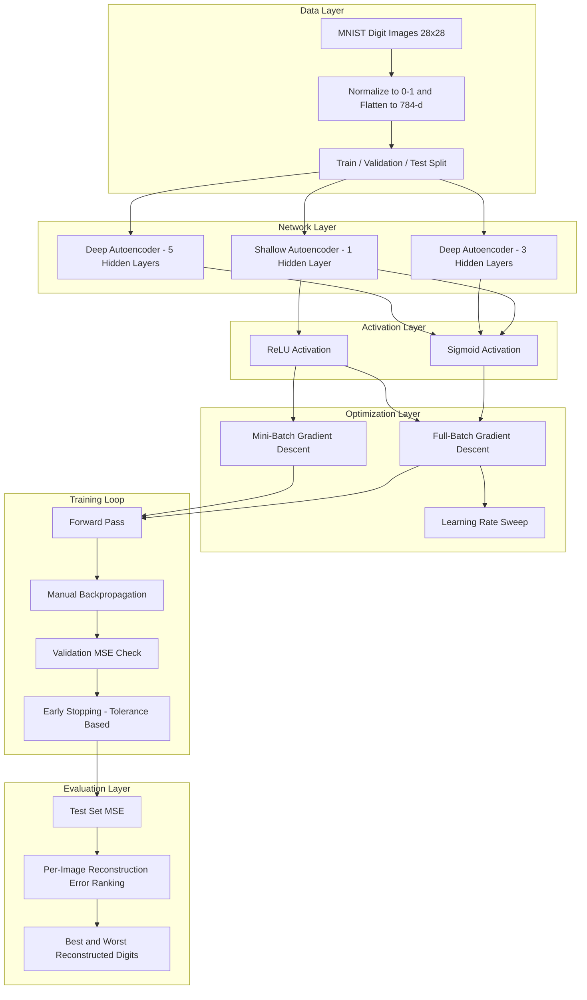
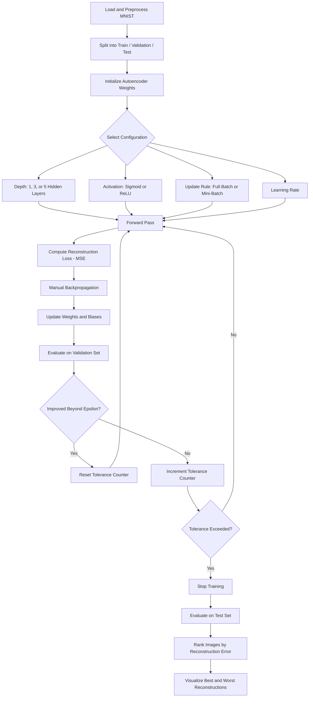

<div align="center">
  
</div>

---

# From-Scratch Autoencoder Architecture and Optimizer Study on MNIST

A NumPy-only implementation of autoencoders trained on MNIST, comparing network depth, activation functions, and gradient-descent regimes to identify the configuration that minimizes reconstruction error — with no deep learning framework used for modeling or training.

<div align="left">

[](https://www.python.org/)
[](https://numpy.org/)
[](https://matplotlib.org/)
[](https://www.tensorflow.org/)
[](http://yann.lecun.com/exdb/mnist/)
[](#)
[](#)
[](https://opensource.org/licenses/MIT)

</div>

## Abstract

Autoencoders are commonly trained with high-level deep learning frameworks that abstract away the underlying optimization mechanics. This project instead implements the full forward pass, loss computation, and backpropagation of an autoencoder **manually in NumPy**, and uses this from-scratch implementation as a testbed to study how architectural depth (1, 3, and 5 hidden layers), activation function (Sigmoid vs. ReLU), and weight-update regime (full-batch vs. mini-batch gradient descent, across multiple learning rates) affect reconstruction quality on MNIST. The best-performing configuration is selected using a validation-based early-stopping criterion and evaluated qualitatively by visualizing the digits with the lowest and highest per-image reconstruction error.

## Table of Contents

1. [Overview](#overview)
2. [System Architecture](#system-architecture)
3. [Training and Evaluation Workflow](#training-and-evaluation-workflow)
4. [Methodology](#methodology)
   - 4.1 [Network Architectures Compared](#41-network-architectures-compared)
   - 4.2 [Activation Functions](#42-activation-functions)
   - 4.3 [Optimization Regimes](#43-optimization-regimes)
   - 4.4 [Convergence Criterion](#44-convergence-criterion)
5. [Experimental Setup](#experimental-setup)
6. [Results and Analysis](#results-and-analysis)
7. [Project Structure](#project-structure)
8. [Usage and Installation](#usage-and-installation)
9. [License](#license)
10. [Author](#author)

# Overview

An autoencoder learns to compress an input into a lower-dimensional latent representation and reconstruct it back, making reconstruction error a direct proxy for how well a given architecture and optimization strategy capture the underlying data manifold. This project builds every component of that pipeline by hand — weight initialization, the forward pass, the loss, and the backpropagation update rule — and uses it to run a controlled sweep over:

- Network depth: a shallow single-hidden-layer autoencoder vs. deep 3- and 5-hidden-layer bottleneck architectures
- Activation function: Sigmoid vs. ReLU (with their corresponding manually derived gradients)
- Update rule: full-batch gradient descent vs. mini-batch gradient descent at different batch sizes
- Learning rate sensitivity across several orders of magnitude

The final selected network is then used to rank all test images by reconstruction error and visualize the digits it reconstructs best and worst.

---

# System Architecture

The pipeline is organized as a linear experimentation flow: raw MNIST digits are preprocessed once, then routed through a family of candidate autoencoder configurations that share the same manually implemented training loop, validation-based convergence check, and evaluation stage.



### Architectural Components

| Layer              | Responsibility                                                        |
| :------------------ | :---------------------------------------------------------------------- |
| Data Layer         | Loading, normalizing, and splitting the MNIST dataset                  |
| Network Layer      | Candidate autoencoder depths (1, 3, and 5 hidden layers)                |
| Activation Layer   | Sigmoid and ReLU forward/backward transformations                      |
| Optimization Layer | Full-batch and mini-batch weight-update rules, learning rate sweep     |
| Training Loop      | Forward pass, manually derived gradients, validation-based early stop  |
| Evaluation Layer    | Test MSE, per-image error ranking, qualitative reconstruction review   |

This structure isolates the effect of each design choice — depth, activation, and update rule — while keeping the loss function, convergence criterion, and evaluation protocol identical across every run, making the resulting comparison fair.

# Training and Evaluation Workflow



---

# Methodology

## 4.1 Network Architectures Compared

Three families of symmetric encoder-decoder architectures are implemented from scratch:

- **Shallow (1 hidden layer):** `784 → 64 → 784` and `784 → 128 → 784`
- **Deep (3 hidden layers):** `784 → 256 → 64 → 256 → 784`
- **Deep (5 hidden layers):** `784 → 256 → 128 → 64 → 128 → 256 → 784`

All weight matrices are randomly initialized and updated purely through manually derived gradients — no autograd or optimizer library is used.

## 4.2 Activation Functions

Both the Sigmoid and ReLU activation functions, along with their derivatives, are implemented by hand for use in the forward pass and backpropagation:

```python
def sigmoid(x):
    return 1 / (1 + np.exp(-x))

def sigmoid_derivative(x):
    return x * (1 - x)

def relu(x):
    return np.maximum(0, x)

def relu_derivative(x):
    return np.where(x > 0, 1, 0)
```

## 4.3 Optimization Regimes

Two weight-update strategies are compared on the same shallow ReLU architecture:

- **Full-batch gradient descent**, with a learning-rate sweep across `1e-6`, `1e-3`, and `1e-2`
- **Mini-batch gradient descent**, with batch sizes of `8` and `16`

## 4.4 Convergence Criterion

Training stops automatically once the validation MSE fails to improve by more than `epsilon = 1e-4` for `tolerance = 20` consecutive epochs, which prevents unnecessary training once the network has plateaued and keeps the comparison across configurations consistent.

---

# Experimental Setup

| Component               | Configuration                                            |
| :------------------------ | :--------------------------------------------------------- |
| Dataset                  | MNIST handwritten digits                                   |
| Preprocessing            | Flattened to 784-d vectors, pixel values scaled to [0, 1] |
| Train / Validation Split | 50,000 training images / 10,000 validation images         |
| Test Set                 | 10,000 official MNIST test images                          |
| Loss Function            | Mean Squared Error (reconstruction loss)                    |
| Max Epochs               | 100                                                        |
| Early Stopping           | `epsilon = 1e-4`, `tolerance = 20` epochs                 |
| Optimizer                | Manually implemented full-batch and mini-batch gradient descent |
| Framework                | Pure NumPy (TensorFlow used only to load the MNIST dataset) |

---

# Results and Analysis

### Test Set Reconstruction MSE by Configuration

| Configuration                | Architecture                       | Activation | Learning Rate | Update Rule           | Test MSE   |
| :----------------------------- | :----------------------------------- | :---------- | :-------------- | :---------------------- | :---------- |
| Shallow-64                    | 784-64-784                          | Sigmoid    | 0.001           | Full-batch              | 0.1245     |
| Shallow-128                   | 784-128-784                         | Sigmoid    | 0.001           | Full-batch              | 0.1269     |
| Deep-3-Layer                  | 784-256-64-256-784                  | Sigmoid    | 0.001           | Full-batch              | 0.1744     |
| Deep-5-Layer                  | 784-256-128-64-128-256-784          | Sigmoid    | 0.001           | Full-batch              | 0.1722     |
| ReLU-Baseline                 | 784-64-784                          | ReLU       | 0.001           | Full-batch              | 0.1140     |
| ReLU-Low-LR                   | 784-64-784                          | ReLU       | 0.000001        | Full-batch              | 0.1140     |
| ReLU-High-LR                  | 784-64-784                          | ReLU       | 0.01            | Full-batch              | 0.1140     |
| ReLU-Mini-Batch-8             | 784-64-784                          | ReLU       | 0.001           | Mini-batch (size 8)    | 0.1212     |
| **ReLU-Mini-Batch-16 (Best)** | 784-64-784                          | ReLU       | 0.001           | Mini-batch (size 16)   | **0.1137** |

### Observations

- Both shallow single-hidden-layer autoencoders outperform the deeper 3- and 5-hidden-layer sigmoid architectures, indicating that added depth does not help — and slightly hurts — this from-scratch setup without normalization or advanced weight initialization.
- Switching the hidden activation from Sigmoid to ReLU lowers the reconstruction MSE at the same architecture and learning rate (`0.1245 → 0.1140`).
- The three full-batch ReLU runs (`1e-6`, `1e-3`, `1e-2`) converge to the same test MSE, suggesting that under this validation-based early-stopping criterion the update rule and batching strategy matter more than the learning rate itself in this configuration.
- Mini-batch gradient descent with a batch size of 16 achieves the lowest test MSE of the entire sweep, making it the selected "best network," which is then used to visualize the digits with the smallest and largest per-image reconstruction error.

---

# Project Structure

```text
From-Scratch-Autoencoder-Architecture-and-Optimizer-Study-on-MNIST
│
├── mnist_autoencoder_from_scratch.ipynb
└── README.md
```

---

# Usage and Installation

```bash
# 1. Clone the repository
git clone https://github.com/ParmidaGh/From-Scratch-Autoencoder-Architecture-and-Optimizer-Study-on-MNIST.git
cd From-Scratch-Autoencoder-Architecture-and-Optimizer-Study-on-MNIST

# 2. Create and activate environment
conda create -n mnist-autoencoder python=3.10
conda activate mnist-autoencoder

# 3. Install dependencies
pip install -r requirements.txt
# Core deps: numpy, matplotlib, tensorflow
```

### Reproducibility

To reproduce the results, run the cells of `mnist_autoencoder_from_scratch.ipynb` sequentially; MNIST is downloaded automatically via `tf.keras.datasets.mnist.load_data()`. Weight initialization is not seeded, so exact MSE values may vary slightly between runs while the overall ranking of configurations remains consistent.

---

# License

This project is licensed under the MIT License.

---

## Author

**Parmida Ghamari** M.Sc. Student, University of Tehran
Research Assistant @ Social Networks Lab

**Research Interests:** Deep Learning Fundamentals, Neural Network Optimization, Representation Learning (Autoencoders), NLP, Large Language Models (LLMs), Agentic AI, Retrieval-Augmented Generation (RAG)

📧 [Parmida.ghamari@gmail.com](mailto:Parmida.ghamari@gmail.com) | 💻 [github.com/ParmidaGh](https://github.com/ParmidaGh) | 💼 [linkedin.com/in/parmida-ghamari](https://www.linkedin.com/in/parmida-ghamari)

---

<p align="center">
Built using NumPy, Matplotlib, and TensorFlow
</p>
